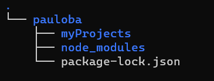

# Conceptos

## Terminal
La terminal es la ventana que muestra el prompt y aloja el shell. Cuando se habla de terminal generalmente se hace referencia a la interfaz gráfica del prompt en la que se pueden introducir los comandos.

## Shell (Línea de comandos)
Es el programa que recibe los comandos y después los envía al sistema operativo para realizar una acción determinada. Existen diversos tipos de shell:
- Bourne Shell
- Bash Shell
- Z Shell
- C Shell
- Korn Shell
- Fish Shell
- Power Shell (Windows)

## Directorio
Un directorio es una carpeta que contiene archivos u otros directorios. El funcionamiento de una computadora en la actualidad se basa en un sistema de archivos que se puede representar como un arbol en el que cada rama es un directorio.

## Archivo
Un archivo es una forma de almacenar información en una computadora. Los archivos se pueden clasificar en dos tipos:
- De texto
- Binarios
Los archivos de texto son aquellos que un humano puede comprender sin necesidad de un programa que interprete la información. Los archivos binarios son aquellos que requieren de un programa para poder acceder a ellos (Ej. Fotos, videos, música, ejecutables, etc).

## Sistema de archivos
Un sistema de archivos funciona como un árbol, el cuál inicia en '\/ ' (root) y se va dividiendo en diversos directorios. Un sistema de archivos se puede representar como un árbol de nodos:

## Comandos
Un comando es una orden que se envía al sistema operativo para realizar una acción en específico. Este puede ser de distintos tipos:
- Programa ejecutable
- Un comando de utilidad del Shell
- Una función del Shell
- Un alias de otro comando

## Wildcards
Serie de caracteres especiales que permiten realizar búsquedas avanzadas. Son parecidos a los caracteres de expresiones regulares en cuanto a funcionalidad, sin embargo, estos varían en cuanto a la forma en que se representan.