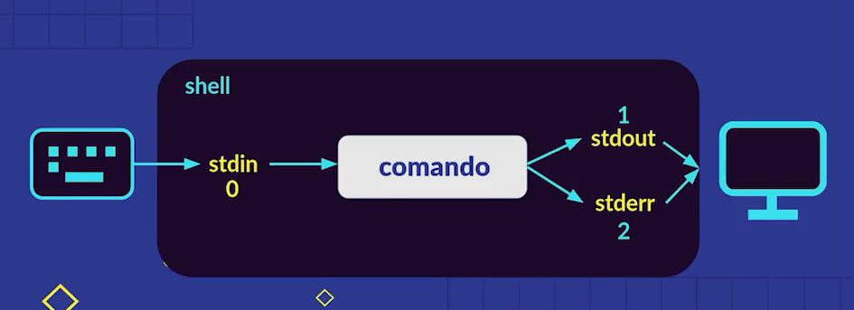

# Redirecciones: como funciona shell

Existen operadores especiales que nos permiten realizar distintas funciones dentro de la terminal.

## Procesos dentro de la terminal
La terminal tiene 3 códigos principales (conocidos mejor como file descriptors). Estos son:
- stdin (0).- El standard input hace referencia a la entrada realizada por el usuario (generalmente por el teclado aunque también es posible imporatar de algún archivo).
- stdout (1).- El standard output se refiere a la respuesta recibida por la terminal en caso de que el comando se ejecute correctamente.
- stderr (2).- El standard error es una respuesta alternativa de la terminal en caso de que surja un error al momento de ejecutar el comando

***Ejemplo***

*Una entrada estándar*
~~~
$ ls ./test/
~~~

*Una salida estándar*
~~~
index.html    styles.css    index.js
~~~

*Un error estándar*
~~~
ls: cannot access 'test': No such file or directory
~~~

## Caracteres especiales

### **\> (Mayor que)**
Este permite redireccionar la información ofrecida por la consola hacia un archivo. En caso de que el archivo no exista, este es creado por el mismo comando. Al usar este operador no se está concatenando la información, sino que se está reescribiendo el archivo por lo que hay que tener cuidado al momento de usarlo.

***Ejemplo*** *Para redireccionar la lista de archivos en un directorio a un archivo de texto 'list.txt'*
~~~
$ ls dirname/ > list.txt
~~~

### **\>\> (Doble mayor que)**
Al usar este operador ocurre algo similar que en el anterior caso, sin embargo se concatena la información redirigida a la información ya existente en el archivo

***Ejemplo*** *Para añadir el árbol del directorio al archivo 'list.txt'*
~~~
$ tree dirname/ >> list.txt
~~~

### **\< (Menor que)**
Este operador no es muy usado debido a que existen comandos específicos que realizan la misma tarea. Sin embargo es útil saber como funcionan estos comandos a partir de redireccionar la información del archivo al stdin.
***Ejemplo*** *Mostrar el contenido de un archivo llamado 'session.log' haciendo uso del operador de stdin*
~~~
$ cat < session.log
~~~

## Información extra

- Por defecto la terminal introduce al archivo el stdout, si se quiere escribir el stderr en el archivo es necesario incluir el file descriptor.

***Ejemplo*** *Se quiere introducir el stderr del comando en un archivo 'err.txt'*
~~~
$ ls nondir/ 2> err.txt
~~~

- Para devolver el stdout o el stderr (sin saber si habrá un error o no) se puede usar el operador de forma normal inicialmente y al final colocar el file descriptor con un \& (ampersand) para indicar que también se incluirá el stderr.

***Ejemplo*** *Se busca redirigir el error o el stdout a un archivo 'out.txt' del comando listar directorios*
~~~
$ ls dirname/ > out.txt 2>&1
~~~

## Pipe operator
Es un operador que permite pasar el stdout como el stdin de otro comando y pr lo tanto se puede filtrar, encadenar y crear varias funcionalidades. Este se representa con un **'|' (pleca)** y la sintaxis es la siguiente:
~~~
$ cmd1 | cmd2 | cmd3 | ... | cmdn
~~~
En este caso el stdout del primer comando pasa como stdin del segundo comando, el stdout del segundo comando pasa a su vez como el stdin del tercer comando y así por 'n' comandos.

### Filtros
Se puede utilizar el pipe operator para filtrar la información de un stdout antes de pasarla a un archivo. Por ejemplo, haciendo uso del comando `sort`.
~~~
$ ls dirname/ | sort | tee filename.ext
~~~
se tiene la lista de archivos y directorios ordenada

### Notas
Al momento de usar el pipe operator hay que tener cuidado con los comandos que no pasan correctamente el stdout al siguiente comando, con lo que el proceso se rompería y saldría un error

## Comandos extra
- `echo` .- Es un comando que permite generar un stdout en la terminal de algún mensaje que se escrito por el usuario.
~~~
$ echo "message"
~~~

- `cat`(concatenate).- Este comando permite concatenar en un solo stdout la información de dos o más archivos.
~~~
$ cat file1.ext file2.ext ... filen.ext
~~~

- `tee` .- Este comando tiene el mismo uso que el operador '\>' para pasar el stdout a un archivo, sin embargo es mucho más útil cuando se hace uso del pipe operator.
~~~
$ cmd1 | tee file.ext
~~~

- `sort` .- Permite ordenar el contenido de un archivo o un stdout.
~~~
$ sort filename.ext
~~~

- `cowsay`.- Muestra una imagen de una vaca diciendo un mensaje escrito por el usuario
~~~
$ cowsay "message"
~~~

- `lolcat` .- Muestra el contenido de un archivo en colores aleatorios
~~~
$ lolcat ./filename.ext
~~~
